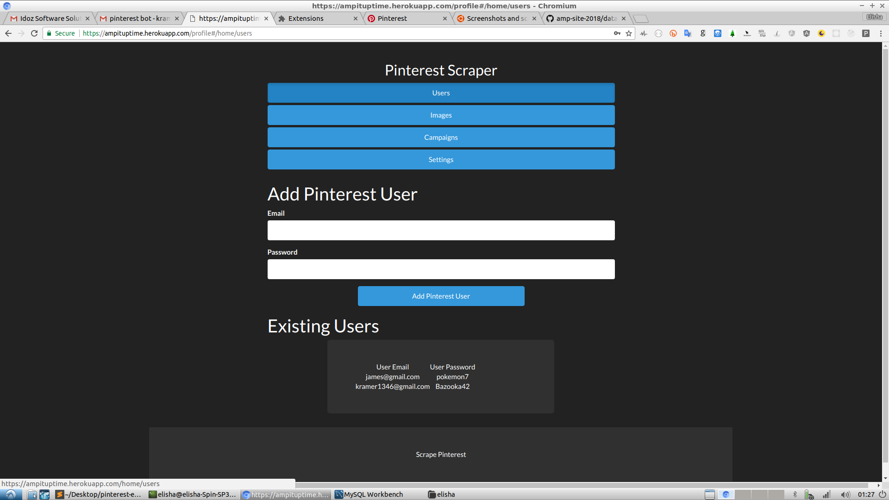
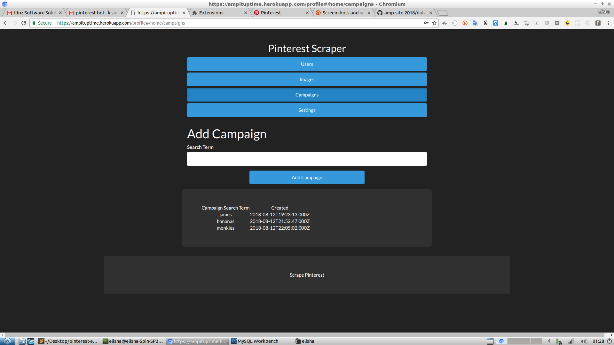
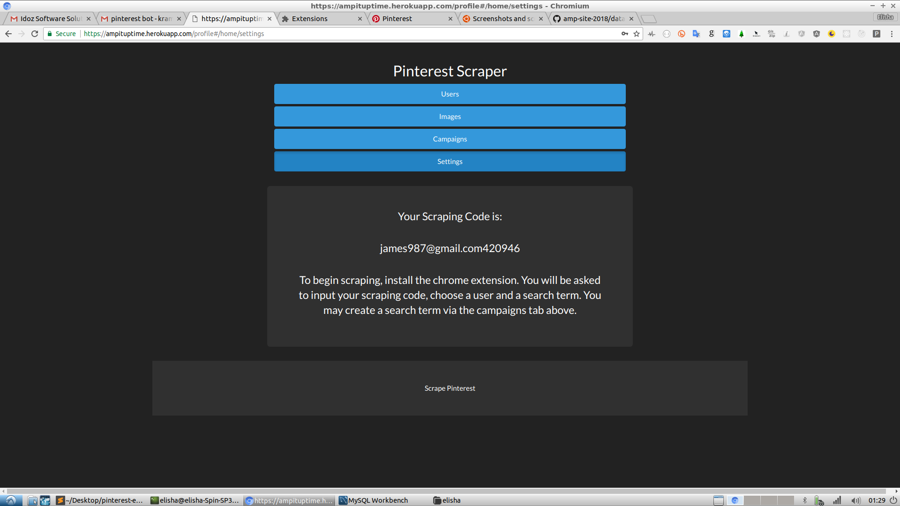
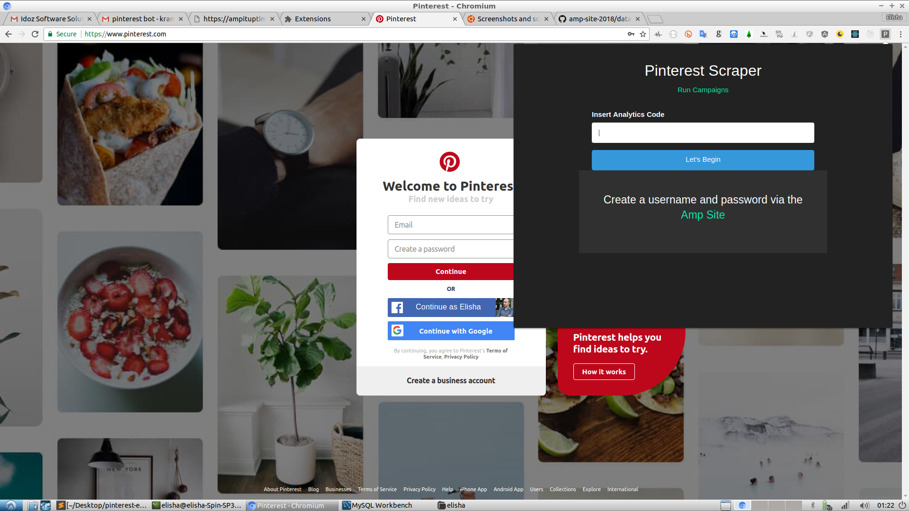
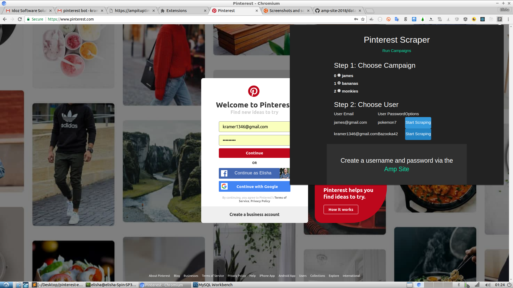
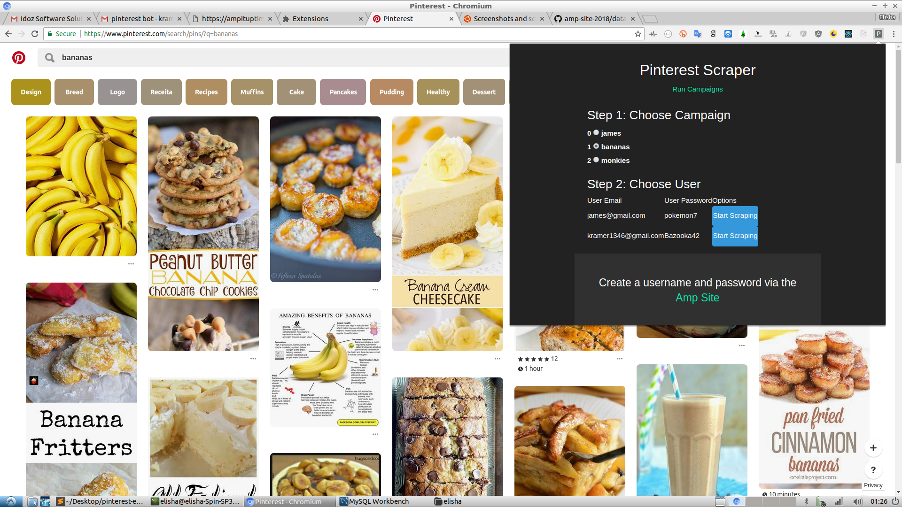
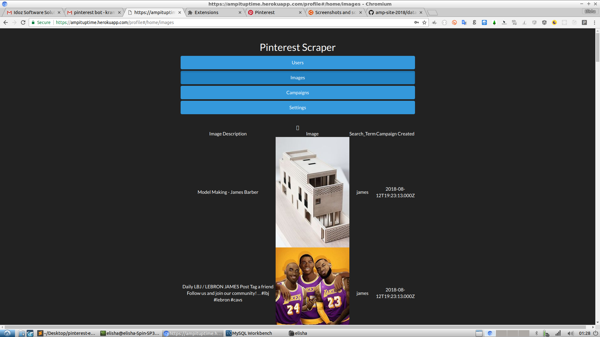

# pinterest_bot

This repo contains the Chrome Extension 

<h1>Screenshots</h1>

<h3>Step 1: Via the Admin GUI. Add the credentials of your Pinterest User</h3>

 

<h3>Step 2: Create your campaign Search Term</h3>

 

<h3>Step 3: Copy your Scraping Code</h3>

 

<h5>Step 4: To work with the extension, you should navigate to 'https://www.pinterest.com/' and verify that you are logged out. You will see the little "P" icon at the top right of your browser once you load the unpacked extension. Click the icon. It will allow you to input the scraping_code mentioned above. Your campaign Search_terms and saved_users will already be loaded there and you can choose the combo of user and search_term to start scraping with.</h5>

 

 

 

<h3>Step 5: Now that the scraping is complete, go back to your Admin GUI (to the 'Images' Tab) - all your scraped images willl appear there.</h3>

 

<h1>Project Structure and Helpful Links for Development</h1>

Happy to present the pinterest scraping bot.

You can view the admin gui here:

https://ampituptime.herokuapp.com/login

Here is a demo account to log in with:

Username: james987@gmail.com
Password: james

The site is deployed to heroku - it also contains all the API calls necessary for the project.

The server code is available here: https://github.com/ElishaKay/amp-site-2018

The actual scraping is being done by a Chrome Extension. Once a client creates an account via the Admin UI, he is provided with a 'scraping_code'. The client will then need to download the Chrome Extension, input the scraping_code, and choose a Pinterest User, and saved Search Term that he defined within the admin UI.

The Extension code is available here: https://github.com/ElishaKay/pinterest_bot

I've pointing the extensions API Calls to the live heroku server mentioned above - you can also easily point the API called to localhost:5000 for testing purposes (just one variable to change).